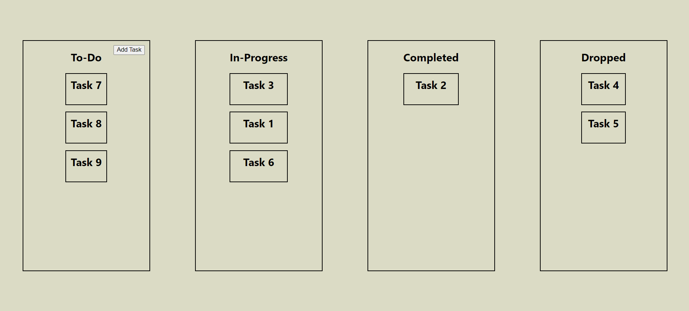
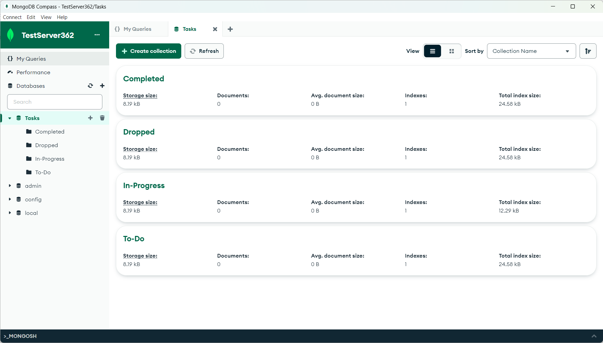
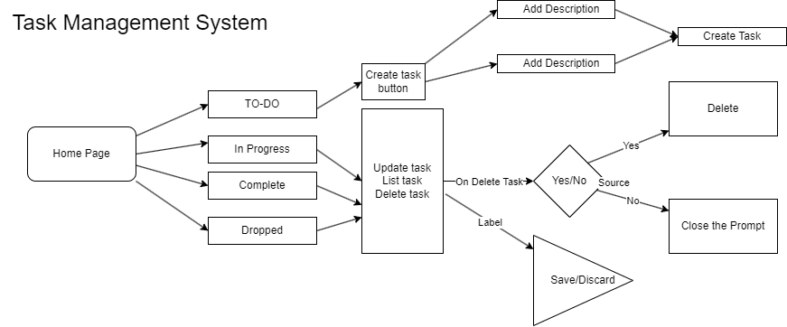

# Task Management System (Group 4)

## What is This?
Group 4 project is a web-based application that allows users to manage and track tasks using a Kanban-style board. The project consists of a React frontend and a Flask backend with MongoDB as the database.

## Requirements
- Node.js
- Visual Studio Code
- Mongo Compass

## How to Run

[Video Demonstration Link]: https://youtu.be/1lJfDy_az8E

Setting up the database:

Have MongoDB Tools installed on your system.

Navigate to ‘/task-management-system/database’ within the applications directory in the terminal and run the following command:

	mongorestore

Verify through MongoDBCompass or mongosh that the Tasks database has been restored on your computer.

To run the Kanban Board application:

Make sure you have Node.js and Python installed on your system.

Navigate to the `/task-management-system` of the application directory in the terminal.

Install the required React dependencies by running the following command:

`npm install axios`

`npm install react-modal`

Install the required React dependencies by running the following command:

`npm install`

Navigate to `/task-management-system/backend` in the terminal and run the following command to initial the backend server:

`pip install -r requirements.txt`

In a separate terminal window, navigate to the `task-management-system` and start the React development server by running the following command:

`npm start`

Open your web browser and visit http://localhost:3000 to access the application.

Frontend (App.js)

The frontend of the application is built using React and is responsible for rendering the user interface and handling user interactions.

## Software Requirement Specification

## Scrum Update @ 16th February

What we did today:

* Everyone contributes to the README.md

* Shaun Anderson: Create the repository and share it with everyone.

* Chris Hilton: Create a Discord Server for communication.

* Aisha Deejay: Research Front End tools project

* Vincent Nguyen: Research Back End tools for project

What we discussed:
* Planning: We briefly discussed the overview of the project and began planning.

* Requirements:
 We are thinking of using React for Front End development and SQL for the database.
 

What's for next:

* Rough sketch for UI

## Scrum Update @ 8 March

What we discussed today:

More planning, front-end development for the next 2 weeks.

We will begin designing and implementing the user interface of the task management system.

Requirements:
* 4 Main Column Categories (TO-DO, In Progress, Complete, Dropped).
* Tasks will be represented as rectangular boxes nested within the columns
* Each Task will have a dropdown menu with buttons for executing specific actions (Move to, Edit, Delete, etc...)
* Tasks can only be created in the TO-DO column.

Week of 3/15/24
Shaun- work on front end
Chris- work on data base
Vincent- work on back end
Aisha- will take updates from everyone once a week and update readme
Tasks Done- 
Worked on front end